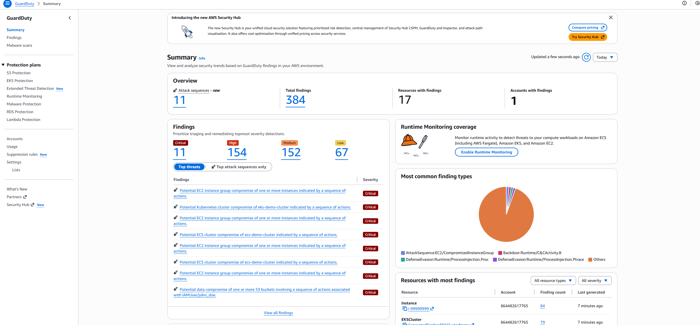
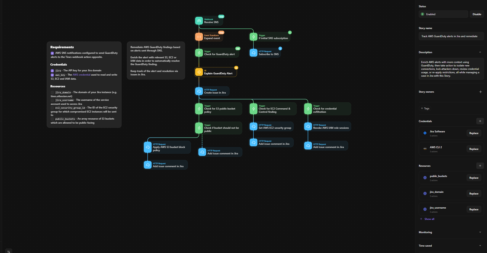
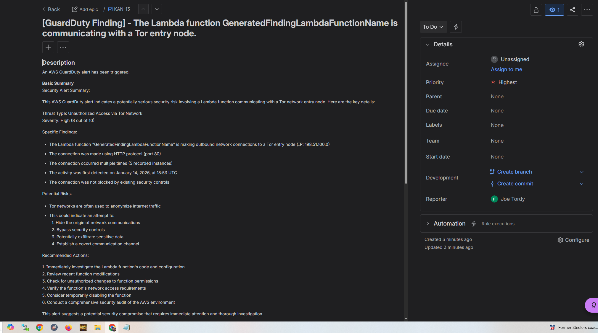
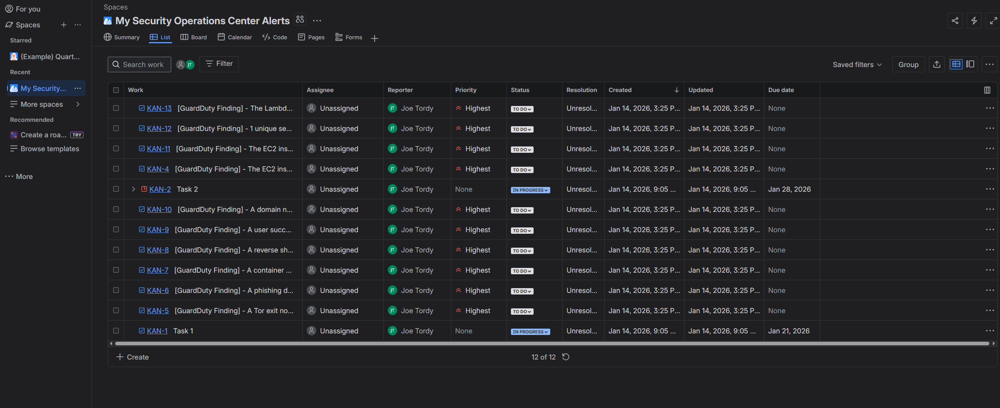

# AWS GuardDuty SOAR Incident Response Automation

## Description

This project demonstrates an automated cloud incident response workflow that integrates **AWS GuardDuty**, **Amazon EventBridge**, **Amazon SNS**, **Tines (SOAR)**, **AI-assisted alert analysis**, and **Jira** for structured incident tracking.

The goal of this project is to mirror real-world **Security Operations Center (SOC)** workflows by automating alert ingestion, enrichment, analysis, and case management for cloud security events.

---

## Architecture

The solution uses an event-driven architecture to handle cloud security findings end-to-end:

AWS GuardDuty  
↓  
Amazon EventBridge  
↓  
Amazon SNS  
↓  
Tines (SOAR + AI)  
↓  
Jira (Incident Tracking)

---

## Key Objectives

- Detect suspicious or malicious activity using AWS GuardDuty
- Automatically ingest GuardDuty findings into a SOAR platform
- Enrich and normalize alert data for analyst consumption
- Generate AI-assisted summaries to speed up triage
- Create and manage incidents in Jira for auditability and tracking
- Demonstrate scalable, repeatable SOC automation

---

## Detection Source: AWS GuardDuty

AWS GuardDuty continuously monitors:
- CloudTrail logs
- VPC Flow Logs
- DNS logs

It identifies behaviors such as:
- Unauthorized access attempts
- Compromised EC2 or Lambda activity
- Public S3 bucket exposure
- Anomalous network communication (e.g., Tor usage)

**Screenshot: AWS GuardDuty findings summary**  

---

## SOAR Automation with Tines

Tines orchestrates the automated incident response workflow by:

- Receiving GuardDuty events via webhook (SNS delivery)
- Expanding and parsing event payloads
- Validating GuardDuty findings
- Enriching alerts with AWS context
- Triggering AI-assisted analysis
- Creating and updating Jira incidents
- Executing remediation logic where applicable

This approach reduces alert fatigue while ensuring consistent handling of cloud security incidents.

**Screenshot: Tines workflow canvas**  

---

## AI-Assisted Alert Analysis

An AI step generates a structured, analyst-friendly summary for each GuardDuty finding, including:

- Plain-language explanation of the alert
- Threat type and severity
- Potential risks and impact
- Recommended investigation and response actions

**Design decision:**  
AI is used strictly for **context and explanation**, not autonomous decision-making, reflecting responsible SOC usage.

**Screenshot: AI-generated summary within Jira**  

---

## Incident Tracking with Jira

For each GuardDuty finding, the workflow automatically creates a Jira issue containing:

- GuardDuty finding ID
- Region and severity
- Threat type
- AI-generated summary
- Recommended response steps
- Timestamps for detection and ticket creation

Jira serves as the system of record for incident tracking, collaboration, and auditability.

**Screenshot: Jira SOC alert board**  

---

## Security & Design Considerations

- Least-privilege AWS credentials are used
- Automation is designed to be observable and auditable
- Logic supports safe handling of high-volume alerts
- Workflow is extensible for approval gates and severity-based branching
- Emphasis on analyst visibility and control

---

## Testing & Validation

- GuardDuty sample findings were generated
- Events successfully flowed through EventBridge and SNS
- Tines received and processed GuardDuty alerts
- AI summaries were generated correctly
- Jira issues were created automatically and consistently

---

## Tools & Technologies

- AWS GuardDuty
- Amazon EventBridge
- Amazon SNS
- Tines (SOAR platform)
- Jira
- AI-assisted summarization (via Tines)

---

## Skills Demonstrated

- Cloud security monitoring
- Event-driven architecture
- SOAR workflow automation
- Incident response lifecycle
- AI-assisted security analysis
- SOC tooling integration

---

## Notes

This project reflects **real-world SOC automation patterns**, focusing on clarity, reliability, and analyst support rather than theoretical detection logic. It is designed as a foundation that could be extended with additional controls, metrics, and approval workflows in a production environment.
